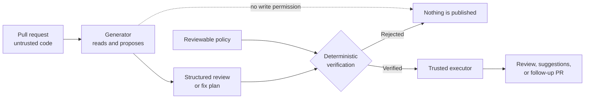
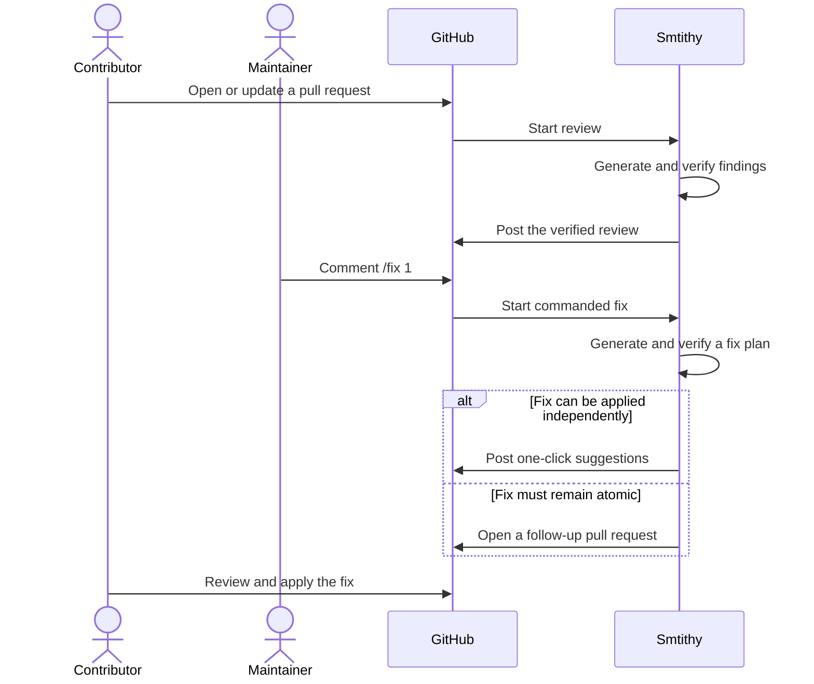

# Smtithy

Smtithy is an AI code reviewer for GitHub pull requests that treats every model
response as untrusted.

It reviews a change, reports concrete findings with file-and-line references,
and can prepare a fix when a maintainer asks for one. Before a review or fix is
written to GitHub, a deterministic verifier checks the model's proposal against
a reviewable policy. The model never receives permission to write to your
repository.

## What it does

Add Smtithy to a repository and it becomes part of the pull request workflow:

1. A pull request opens or changes.
2. Smtithy reads the pinned diff and relevant repository context.
3. It posts a single, updateable review containing:
   - findings that identify the affected file and changed line;
   - a summary of the change;
   - residual risks it could not confirm.
4. A maintainer can comment `/fix 1` to request a fix for finding 1.
5. Smtithy proposes the fix as GitHub suggestions when possible, or as a
   follow-up pull request when the change must be applied atomically.

Reviewing and fixing are separate. Smtithy never changes code merely because it
found a problem, and only users with write access can request a fix.

## How safety works

Smtithy assumes that prompts and model behavior are not security boundaries.
It separates the system into three parts:

**Generate -> verify -> execute**



- The **generator** uses a model to propose a structured review or fix plan. It
  has no repository write permission.
- The **verifier** deterministically checks the complete proposal against
  [`policy.json`](src/smtithy/policy.json). If any part is invalid, the whole
  proposal is rejected.
- The **executor** independently verifies the proposal again before posting a
  review, creating suggestions, or opening a follow-up pull request.

This design limits what a prompt injection, malformed model response, or
overreaching fix can do. Untrusted pull request content is treated as data, and
the small jobs that can write do not run the model.

## Before you install

You need:

- GitHub Actions enabled for the repository;
- an Anthropic API key, a long-term Bedrock API key, or an AWS Bedrock role
  available through GitHub OIDC;
- two GitHub environments:
  - `ai-pr-review`, with required reviewers who all hold write-or-above access;
  - `ai-pr-review-runtime`, with no required reviewers and a deployment branch
    rule that only permits your default branch.

GitHub must enforce environment protection rules for your repository and plan.
On GitHub Free, that means the repository must be public. Smtithy checks the
approval environment at runtime and refuses protected runs if the gate is
missing or ineffective.

## Install

Always pin Smtithy to a full 40-character commit SHA. Do not use a branch or
tag: the workflow and the verifier code must resolve to the same immutable
version.

### 1. Add model credentials

Choose one authentication method:

- **Anthropic API:** add `ANTHROPIC_API_KEY` as a repository Actions secret and
  set `use-bedrock: false` in both workflows below.
- **AWS Bedrock with OIDC:** add `BEDROCK_ROLE_ARN` as a repository Actions
  secret. The role must trust the repository's `ai-pr-review-runtime`
  environment through GitHub OIDC and allow the configured Bedrock model.
  Bedrock with OIDC is the default.
- **AWS Bedrock with a long-term API key:** add `BEDROCK_API_KEY` as a
  repository Actions secret and set `use-bedrock-api-key: true` in both
  workflows. Smtithy passes it to the Bedrock client as
  `AWS_BEARER_TOKEN_BEDROCK`.

### 2. Add the review workflow

Create `.github/workflows/ai-pr-review.yml` in the repository you want Smtithy
to review:

```yaml
name: Smtithy review

on:
  pull_request_target:
    types: [opened, synchronize, reopened, ready_for_review]

permissions: {}

jobs:
  review:
    permissions:
      contents: read
      pull-requests: write
      id-token: write
    uses: svozza/smtithy/.github/workflows/ai-pr-review.yml@<FULL_COMMIT_SHA>
    with:
      project-description: "owner/repository, a short description of the project"
      use-bedrock: false
    secrets:
      ANTHROPIC_API_KEY: ${{ secrets.ANTHROPIC_API_KEY }}
```

For Bedrock, omit `use-bedrock: false` and replace the secret mapping with:

```yaml
    secrets:
      BEDROCK_ROLE_ARN: ${{ secrets.BEDROCK_ROLE_ARN }}
```

To use a long-term Bedrock API key instead of OIDC:

```yaml
    with:
      project-description: "owner/repository, a short description of the project"
      use-bedrock-api-key: true
    secrets:
      BEDROCK_API_KEY: ${{ secrets.BEDROCK_API_KEY }}
```

### 3. Add fixes

To let maintainers request fixes, create
`.github/workflows/ai-pr-fix.yml`:

```yaml
name: Smtithy fix

on:
  issue_comment:
    types: [created]

permissions: {}

jobs:
  fix:
    if: >-
      github.event.issue.pull_request
      && contains(github.event.comment.body, '/fix ')
    permissions:
      contents: write
      pull-requests: write
      id-token: write
      actions: read
    uses: svozza/smtithy/.github/workflows/ai-pr-fix.yml@<FULL_COMMIT_SHA>
    with:
      project-description: "owner/repository, a short description of the project"
      use-bedrock: false
    secrets:
      ANTHROPIC_API_KEY: ${{ secrets.ANTHROPIC_API_KEY }}
```

Use the same Bedrock OIDC or API-key substitution as the review workflow when
applicable.

Do not add a concurrency block to either caller. The reusable workflows define
their own per-pull-request concurrency behavior.

Commit both workflows to the repository's default branch. Opening or updating a
pull request will then start a review.

## Use

Smtithy maintains one review comment per pull request and updates it when a new
commit is reviewed. Findings are numbered so maintainers can request a specific
remediation:



```text
/fix 1
```

The command must be the comment's entire content. A maintainer can request
several findings as one atomic fix:

```text
/fix 1,3
```

Smtithy only accepts commands from users with write access. It also refuses a
command if the pull request has changed since the referenced review, preventing
a fix from being applied to stale code.

Simple, independent edits arrive as GitHub suggestions that a contributor can
apply with one click. Fixes that span files or must remain atomic arrive in a
stacked follow-up pull request. Stacked delivery is available only for
same-repository pull requests; an atomic multi-file fix on a fork has no
automated delivery. Smtithy does not run the proposed code or its tests; the
repository's normal CI remains responsible for validating the result.

## Run artifacts

Smtithy uploads diagnostic Actions artifacts so repository operators can audit
and troubleshoot a run:

| Artifact | Contents | Retention |
| --- | --- | --- |
| `ai-review-<pr>-<head-sha>` | Submitted review when available, harness transcript, captured model streams, model metadata, and review context evidence | 90 days |
| `ai-fix-context-<pr>-<run-id>` | Posted review, commanded finding indices, pull request metadata, diff, and changed-file list used to start remediation | 90 days |
| `ai-fix-plan-<pr>-<run-id>` | Submitted plan when available, harness transcript, captured model streams, model metadata, and remediation context evidence | 90 days |
| `evals-<run-id>` | Review and plan evaluation results, complete redacted transcripts, captured model streams, and semantic-judge evidence when invoked | 30 days |

Artifacts are available from the workflow run's **Artifacts** section. They are
uploaded on failure when the workflow has produced evidence worth preserving.

Treat these artifacts as sensitive repository data. Transcript and model-stream
files are secret-redacted before being written, but context files can contain
pull request bodies, diffs, paths, and source content. Redaction is defense in
depth and cannot recognize every possible secret.

See [Testing strategy](docs/testing.md#results-and-evidence) for evaluation
artifact filenames, download commands, and the full
[redaction boundary](docs/testing.md#redaction-boundary).

## Configure

The reusable workflows expose inputs for the project description, model
provider, model name, AWS region, and timeout. The review workflow also exposes
review-comment presentation inputs. See the `workflow_call.inputs` sections in:

- [AI PR review workflow](.github/workflows/ai-pr-review.yml)
- [AI PR fix workflow](.github/workflows/ai-pr-fix.yml)

`project-description` replaces one fixed project-description clause in the
reviewer and planner prompts. It does not replace either complete prompt.

The shipped policy rejects links by default. To permit verified review and
remediation text to link to documentation, set `link-host-allowlist` in both
caller workflows:

```yaml
    with:
      project-description: "owner/repository, a short description of the project"
      link-host-allowlist: |
        docs.example.com
        github.com/your-org/
```

A trailing slash permits that path and its descendants. A host without a path
permits the whole host. Entries are validated and independently applied by each
generator and executor job; callers cannot supply an arbitrary policy file.

## Develop

To set up a local development environment and run the standard checks:

```bash
uv python install 3.13
uv sync --frozen --all-groups --no-install-project
uv run --frozen --group test \
  python -m pytest tests/ -p no:cacheprovider -q
uv run --frozen --group typecheck \
  ty check --python .venv/bin/python
```

The test suite is deterministic and needs no model credentials. Real-model
evaluations are separate, may incur provider charges, and require additional
configuration. See [Development, tests, and evaluations](docs/development.md)
for commands and environment setup, and
[Testing strategy](docs/testing.md) for test-layer and evaluation guidance.

## Project status

Smtithy is under active development. The review, verification, GitHub posting,
commanded fix, suggestion, reply, and follow-up pull request paths are present.
Interfaces may still change.

## Learn more

- [Development, tests, and evaluations](docs/development.md)
- [Testing strategy](docs/testing.md)
- [Project vocabulary and trust model](CONTEXT.md)
- [Architecture decisions](docs/adr/)
- [Research findings](docs/findings/)
- [Experiment results](results/)
