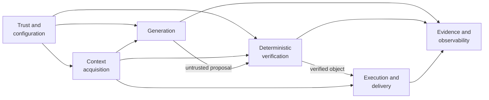
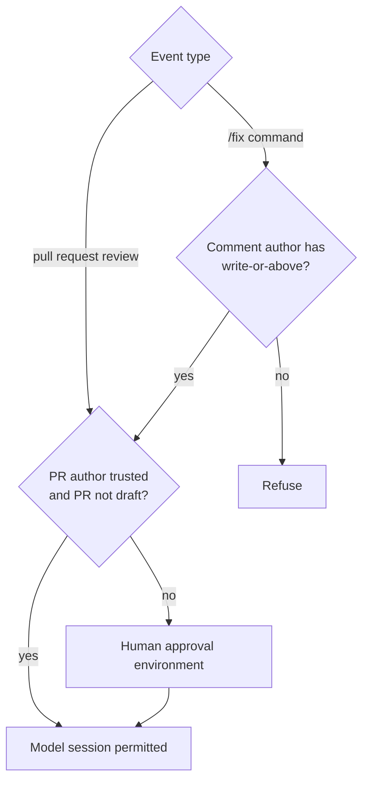
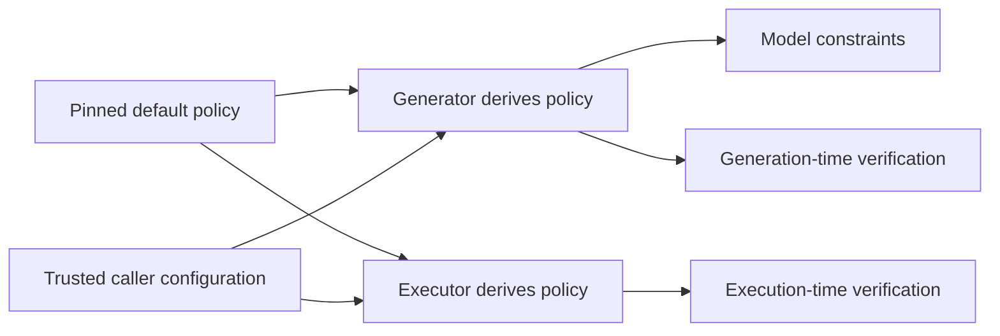
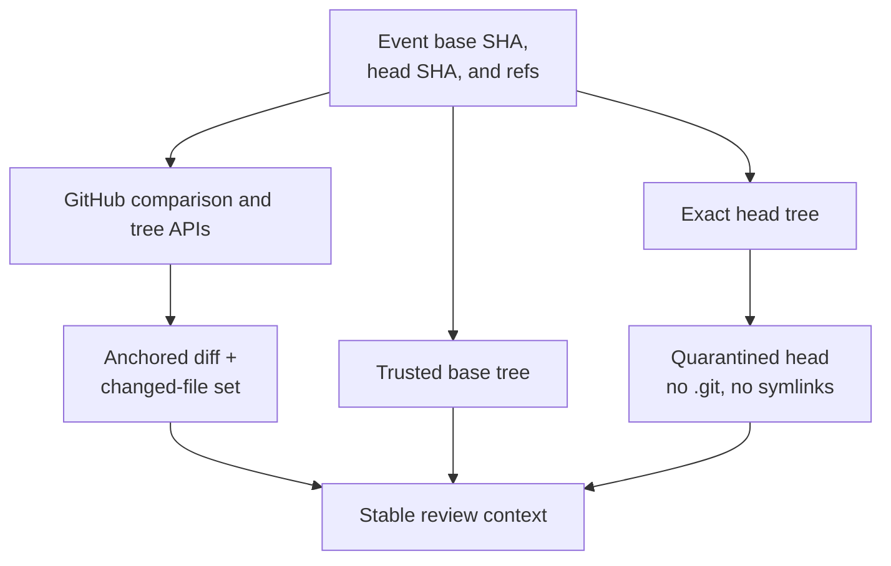
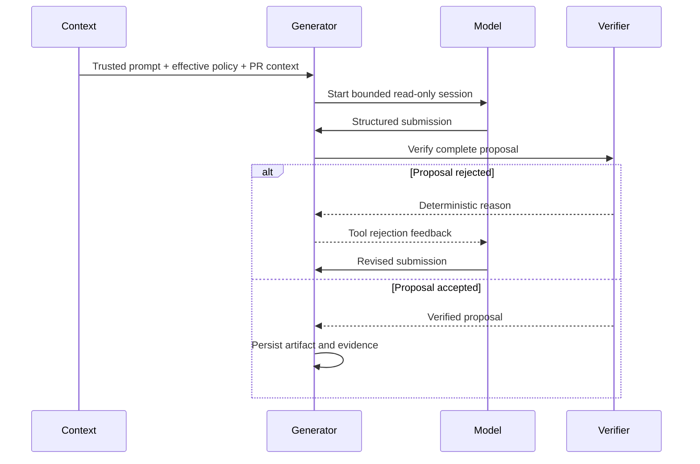
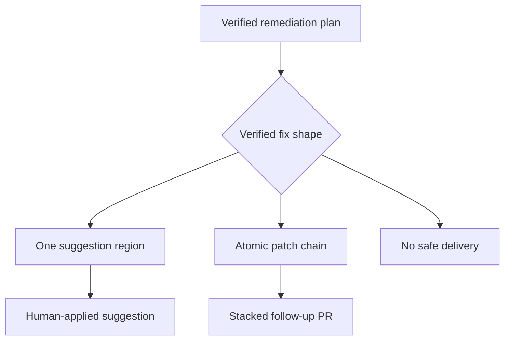
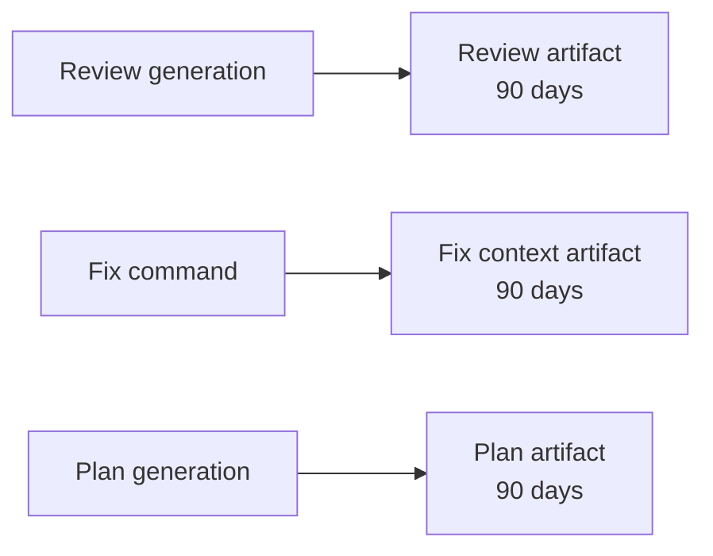

# Architecture

Aceiro is an AI-assisted review and remediation system for GitHub pull
requests. It is designed around one constraint:

> A model may propose an action, but it cannot authorize or perform that action.

Every model-produced review or remediation plan is treated as untrusted data.
A deterministic policy system decides whether the complete proposal is
admissible, and a separately credentialed execution system performs the
resulting GitHub operation.

## System overview

Aceiro is composed of six cooperating systems:

1. **Trust and configuration** decides whether a model session may run and
   derives the policy and credentials for that run.
2. **Context acquisition** constructs an immutable view of the pull request.
3. **Generation** asks a model to propose a review or remediation plan in a
   defined grammar with a strict schema.
4. **Verification** checks the proposal against deterministic policy.
5. **Execution and delivery** re-verifies the proposal and performs a bounded
   GitHub operation.
6. **Evidence and observability** preserves the inputs, proposals, transcripts,
   and metadata needed to understand a run.

These systems run across multiple GitHub Actions jobs. The separation is
intentional: the job that invokes the model does not hold repository write
permission, and the job that writes to GitHub does not invoke the model.

## Architectural principles

### Generate, verify, execute

The model produces a structured proposal rather than directly calling a GitHub
write API. Here, structured means that the proposal must conform to a declared
grammar and schema: known fields, known types, bounded values, and no implicit
instructions outside that representation.

The proposal is checked against deterministic policy. Verification is
whole-object and fail-closed: one violation rejects the review or plan rather
than publishing or executing the acceptable subset.

The executor independently repeats verification. It does not trust an artifact
because an earlier job marked it as verified.

### Prompts are not security boundaries

Prompts tell the model what good behavior looks like, but Aceiro does not rely
on prompt obedience to protect credentials or constrain effects.

Untrusted pull request content is shown to the model as data. Prompt injection
may influence the proposal, but the proposal still has to pass deterministic
verification before it can produce an effect.

### Credentials follow responsibilities

Credentials are scoped per job:

- generation jobs can read the reviewed repository and invoke the model;
- review delivery can write pull request comments;
- suggestion delivery can write pull request review comments;
- stacked delivery can create a branch, commit, and follow-up pull request;
- routing and approval jobs hold no delivery credential.

This prevents model-controlled execution from sharing a process with a
repository write credential.

### The reviewed repository does not supply the reviewer

Reusable workflows and harness code are loaded from the immutable Aceiro
commit selected by the caller. The pull request supplies only the content under
review; the behavior that interprets and acts on that content comes from the
pinned Aceiro version.

Consumers may provide narrow trusted configuration, such as project description
and allowed link hosts. They cannot replace the complete policy or prompt at
runtime.

## Trust and configuration system

The trust system answers two separate questions:

1. **May this pull request content reach a model credential without human
   approval?**
2. **May this user command a remediation?**

These questions intentionally use different actors.

The pull request author's repository permission determines whether a human
approval gate is required before a model reads their content. A trusted,
non-draft author may proceed directly. Untrusted authors and drafts wait at the
consumer repository's approval environment.

The comment author's permission determines whether a `/fix` command is
authorized. A maintainer can therefore request a fix on an untrusted
contributor's pull request, but the contributor's content still passes through
the approval gate before it reaches a model credential.

The approval environment is asserted at runtime. Merely referencing an
environment is insufficient because GitHub can create one without protection
rules. When approval is required, Aceiro confirms that required reviewers are
configured and that every eligible reviewer holds write-or-above access.

### Effective policy

Each policy-consuming job derives its own effective policy from:

- the default policy in the pinned Aceiro version; and
- narrow configuration supplied by the consumer's trusted caller workflow.

Currently, consumers can configure verified link hosts. Entries are validated
and canonicalized before replacing the fail-closed default allowlist.

The generator and executor derive policy independently. A generator cannot
alter the policy later used to authorize its output.

### Policy language

[`policy.json`](../src/aceiro/policy.json) is the reviewable security object
interpreted by the deterministic verifiers. `artifact_schema` and
`plan.schema` are JSON Schema Draft 2020-12 documents consumed directly by the
model contracts and verifiers. The remaining policy fields configure
contextual checks that cannot be decided from the candidate JSON object alone.
The effective policy's SHA-256 digest is recorded with run evidence and
rendered in the posted review, so an accepted object can be tied to the policy
that admitted it.

Aceiro defines no custom JSON Schema vocabulary or keywords. Structural
validation therefore has the standard Draft 2020-12 meaning. Markdown,
provenance, secret, ordering, containment, and effect checks remain explicit
verifier phases rather than extensions hidden inside the schema.

The top-level fields are:

| Field | What it controls |
| --- | --- |
| `version` | Policy format metadata. The current verifiers do not dispatch on it. |
| `description` | Maintainer-facing rationale for the shipped policy. It has no enforcement semantics. |
| `artifact_schema` | Draft 2020-12 schema for a review artifact. |
| `review` | Contextual review constraints not expressible in the structural schema. |
| `provenance` | Whether each finding must name a changed file and a line inside a diff hunk. |
| `markdown` | Which Markdown syntax may be published and which link destinations are trusted. |
| `plan` | Draft 2020-12 plan schema plus ordering, containment, effect, and aggregate size constraints. |
| `secret_scan_patterns` | Regular expressions for values that must not survive in accepted model output. |

#### Artifact schema

`artifact_schema` defines the complete review artifact using standard keywords
such as `properties`, `required`, `additionalProperties`, `maxItems`,
`minLength`, `maxLength`, `minimum`, `maximum`, `enum`, `pattern`, and
`oneOf`. The shipped policy requires `summary`, `findings`, and
`residual_risk`, and defines every field of a finding: `path`, `line`,
`severity`, `group`, `title`, and `body`.

The separate `review.max_distinct_groups` constraint bounds how many defect
groups an artifact may claim. It remains a verifier phase because JSON Schema
does not project one property from each array item and bound the number of
distinct projected values. Group identity remains advisory and is never
trusted to authorize or scope remediation.

#### Provenance and Markdown

`provenance.path_must_be_changed_file` confines finding paths to the pinned
changed-file set. `provenance.line_must_be_in_diff_hunk` confines their anchors
to new-side lines in the pinned diff. Both ship enabled.

`markdown.allowed_nodes` is an allowlist of parsed Markdown node types.
Anything outside it rejects the complete artifact or plan. Independently,
`markdown.link_host_allowlist` restricts explicit links and link-like GitHub
references to exact hosts or host-and-path prefixes. The shipped list is empty,
so links fail closed until a consumer supplies trusted destinations.

Some output protections are verifier invariants rather than policy options.
For example, raw HTML, images, unsafe URL forms, bidirectional controls, and
unverified secret candidates cannot be enabled merely by adding a policy
field.

#### Remediation plans

`plan` defines a bounded, straight-line program:

| Field | Meaning |
| --- | --- |
| `schema` | Draft 2020-12 schema for the complete plan and every step kind. |
| `control_flow` | Reserved for future semantics; it must currently be empty. |
| `argument_forms` | Permitted argument forms; currently exactly `["literal"]`. |
| `step_kinds` | Effect classification for each step kind declared by the schema. |
| `ordering` | Required before/after relationships between step kinds. |
| `max_patched_files` | Maximum distinct files affected by `patch` or `suggest` steps. |
| `max_changed_lines` | Per-step changed-line limit. |
| `max_changed_bytes` | Per-step UTF-8 changed-byte limit. |
| `max_plan_changed_bytes` | Aggregate UTF-8 changed-byte limit across the plan. |
| `path_denylist` | Glob patterns that no patch or suggestion path may match. |
| `branch_prefix` | Namespace required for every branch the plan may push or open as a pull request. |
| `label_allowlist` | Exact labels a plan may apply. It ships empty. |

The shipped step kinds are `patch`, `suggest`, `push_branch`, `open_pr`, and
`label`. `plan.schema` declares each kind and its complete argument object
through `oneOf`; `plan.step_kinds` classifies the same kinds by whether they
carry a write-class effect. The verifier refuses disagreement between those two
sets. Step arguments cannot refer to another step's output, and the plan cannot
branch or loop. Ordering constraints apply to every matching pair of steps, not
merely adjacent steps.

Policy is only one layer of plan authorization. The verifier also checks the
plan against run-specific facts that do not live in `policy.json`: the pinned
changed-file set, exact base content, commanded findings, pull request base and
head branches, and whether a proposed delivery can be represented atomically.

#### Customization boundary

Today the reusable workflows accept only narrow policy overlays. The supported
overlay is `markdown.link_host_allowlist`, derived independently in generator
and executor jobs from trusted caller configuration. Consumers cannot provide
an arbitrary replacement policy through a workflow input.

The verifier is designed so broader customization can be added without making
Aceiro the authority on a consumer's risk tolerance: a consumer-selected policy
would define what that deployment accepts, and the consumer would be
responsible for reviewing its security properties. Before exposing that
capability, the workflow still needs a trustworthy policy-loading and pinning
mechanism, evidence that identifies the exact effective policy, and the same
independent derivation at generation and execution time.

## Context acquisition system

The context system creates a stable description of the change under review.
It separates three roots:

- the **harness**, containing trusted Aceiro code, prompts, and default policy;
- the **base tree**, containing trusted pre-change repository context; and
- the **quarantined head**, containing contributor-authored pull request files.

The review comparison is anchored to the base and head SHAs recorded by the
event. The diff and changed-file list come from the same comparison. Pull
request state is checked before and after context collection so a push cannot
silently replace the reviewed change during preparation.

The exact head SHA is fetched into quarantine. Version-control metadata is
removed, symlinks are deleted, and file and diff sizes are bounded before the
model session proceeds.

Contributor-controlled context is scanned for secret candidates before review.
Detected values are replaced with stable placeholders, and the original values
become run-scoped taints used to prevent model output from echoing them.

This is defense in depth rather than a claim that all repository content is
secret-free.

## Generation system

Aceiro has two generators:

- the **review generator** proposes a review artifact; and
- the **remediation generator** proposes a plan for the findings named by a
  maintainer.

Both use the same session pattern:

1. assemble a prompt from trusted instructions, effective policy constraints,
   and fenced pull request context;
2. allow read-only investigation of the base and quarantined head;
3. expose one structured submission tool;
4. verify each submission immediately; and
5. return deterministic rejection feedback to the model within a bounded
   session.

The submission tool is the only accepted output channel. A conversational
answer or an unrelated tool call does not become a review or plan.

This submission pattern exists to make structured output reliable as well as
verifiable. Free-form responses and generic JSON-return modes regularly produced
malformed JSON, omitted required fields, or placed a complete artifact inside
the wrong field. A named submission tool gives each field its own typed argument
and lets the verifier reject an incomplete call immediately, while the model is
still in the same session and can correct it.

### Review generation

The review artifact contains:

- a summary;
- zero or more findings anchored to changed files and lines; and
- residual risk describing uncertainty or unconfirmed concerns.

The generator may investigate repository context, but it cannot run tests,
reach arbitrary network services, edit repository files, or write to GitHub.

### Remediation generation

A remediation session begins only after a valid `/fix` command has been
authorized and bound to a posted Aceiro review for the current head.

The commanded findings are derived from the accepted review and the human-facing
ordinals in the command. The model cannot expand its own remediation scope by
inventing additional findings.

The resulting plan is inert. The generation job does not execute plan steps.

## Verification system

Verification interprets the effective policy as data. The review and plan
verifiers have different object models but share the same posture:

- strict schemas and known vocabulary;
- no unknown fields or implicit behavior;
- provenance against the anchored change;
- bounded text and write surfaces;
- safe rendered Markdown;
- secret and taint checks; and
- whole-object rejection.

### Review verification

Review verification establishes that:

- the artifact has the declared shape and field bounds;
- each finding names a changed file and a line within that file's diff hunks;
- text remains within the permitted rendering grammar;
- links stay within configured hosts;
- active or misleading rendering constructs are rejected; and
- configured or detected secrets are not reproduced.

It does not prove that a finding is factually correct. Model judgement remains
advisory.

### Plan verification

Plan verification establishes that:

- every step has a known type and literal arguments;
- write steps form a legal, bounded sequence;
- touched paths stay within the changed-file frame and outside denied paths;
- the plan covers the findings named by the maintainer;
- replacement anchors match the reviewed head exactly and unambiguously;
- changed bytes and lines remain within policy budgets; and
- plan text and output pass rendering and secret checks.

It does not prove that replacement code fixes the defect or passes tests.
Suggestions remain human-applied, stacked pull requests remain human-merged,
and repository CI validates behavior.

## Execution and delivery system

The executor is the only system allowed to turn a model proposal into a GitHub
effect.

Before any write, it:

1. downloads the proposal artifact;
2. independently fetches trusted comparison data;
3. re-derives commanded findings where applicable;
4. re-runs deterministic verification;
5. confirms the pull request still represents the reviewed state;
6. determines delivery from verified structure; and
7. resolves the authenticated identity used to own or update GitHub objects.

### Review delivery

Review delivery renders a fixed comment structure around verified model text.
One owned sticky comment is maintained per pull request and generator.

Ownership requires both a harness-authored marker and the authenticated
comment author. A copied marker alone does not give another comment ownership.

The pull request head and base are checked before and after posting. If the pull
request changes during the write, Aceiro withdraws its own stale review and
fails the run.

### Remediation delivery

Delivery is computed from verified plan structure, not from a model-selected
mode.

A suggestion is used only when the fix is one independently applicable region.
Multiple coordinated regions or files cannot be emitted as separately
applicable suggestions.

An atomic patch plan creates a stacked pull request based on the original pull
request's head branch. This path is available only for same-repository pull
requests; fork branches do not exist in the base repository.

Delivery jobs are selected by a credential-free router. Routing decides which
credentialed job may start, but each delivery job independently verifies the
plan and refuses any mode outside its explicit allowance.

### Command replies

Some remediation outcomes are not visible on the commanding pull request.
Aceiro can post a dedicated terminal reply for outcomes such as:

- a known undeliverable command;
- an already existing stacked fix;
- a stranded fix branch; or
- a receipt linking to a newly created follow-up pull request.

Internal machinery failures remain failed runs. They are not converted into
model-authored or misleadingly successful replies.

## State consistency and identity

Generation and execution are separated by time and by an artifact boundary.
Aceiro therefore binds proposals to explicit state:

- the head SHA identifies the reviewed revision;
- the base SHA anchors the generated diff;
- the base ref detects retargeting;
- the head ref identifies the contributor branch that remediation must not
  modify directly.

Executors re-fetch live state near the effect. An artifact that was valid for an
earlier head or a different base branch is not applied to the current pull
request.

GitHub objects created by Aceiro use stable identities:

- review comments are updated by marker and authenticated author;
- suggestions are reconciled by finding and code-anchor identity;
- stacked fixes use a key over pull request, reviewed head, and commanded
  findings; and
- command replies are keyed to the command state they describe.

This makes retries converge on existing objects rather than creating duplicate
comments, branches, or pull requests.

## Evidence and observability system

Generation, verification, and execution produce audit evidence independently of
the user-facing GitHub effect.

Evidence may include:

- submitted review or plan artifacts;
- complete redacted harness transcripts;
- complete redacted model streams for each attempt;
- model and policy attribution;
- anchored context used by the run.

Artifacts are uploaded on failure when evidence was produced. Transcript and
model-stream files are redacted before being written, but context files may
still contain pull request bodies, diffs, paths, and source content. Artifacts
are sensitive repository data.

## Failure model

The systems distinguish several outcomes:

| Outcome | Meaning |
| --- | --- |
| **Rejection** | A review or plan violates deterministic policy |
| **Refusal** | A verified object has no supported safe delivery |
| **Decline** | The command channel has a user-relevant reason no fix was delivered |
| **Failed run** | Harness, provider, or infrastructure failure with no safe user-level answer |

The default response is fail-closed:

- invalid reviews are not partially posted;
- invalid plans are not partially executed;
- malformed routing produces no delivery;
- unresolved permissions are treated as untrusted;
- uncertain write operations are not blindly retried.

## System invariants

The architecture depends on the following invariants:

1. The pull request does not supply the harness, prompt, default policy, or
   executor.
2. A process invoking the model does not hold repository write permission.
3. A process performing a model-derived write independently verifies the
   complete object it writes.
4. Review and plan verification are deterministic and fail-closed.
5. Proposals are bound to the exact reviewed comparison and head content.
6. A maintainer command, not the model, defines remediation scope.
7. Delivery is derived from verified structure, not model preference.
8. Credentials are minted only for the job that needs the corresponding effect.
9. GitHub object ownership requires authenticated authorship as well as a
   marker.
10. Evidence is preserved separately from the user-facing effect.
